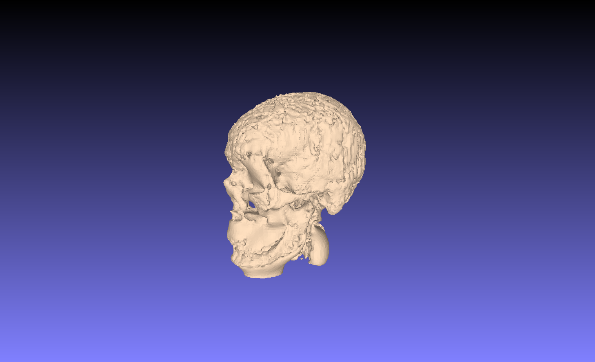
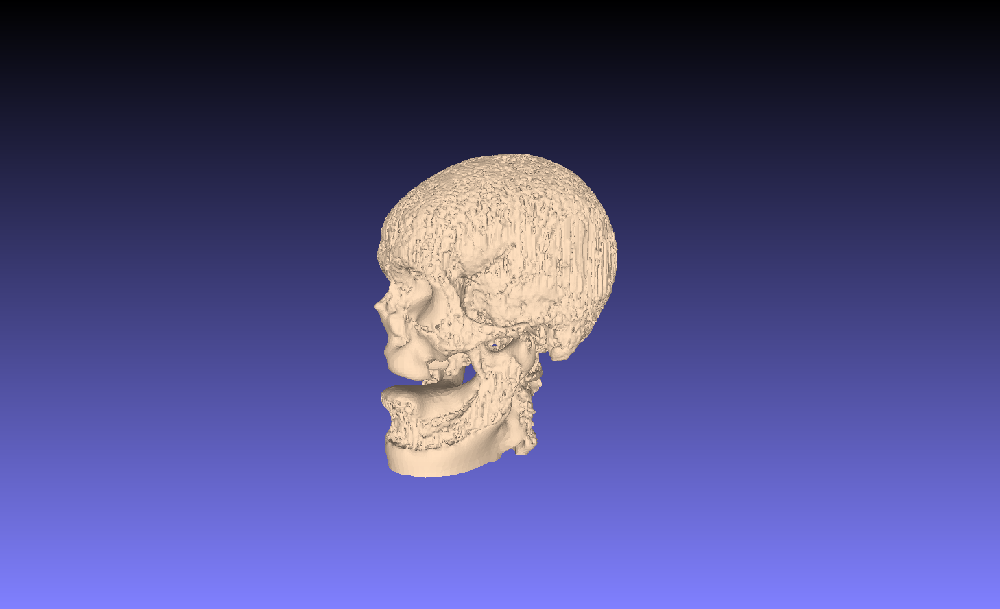
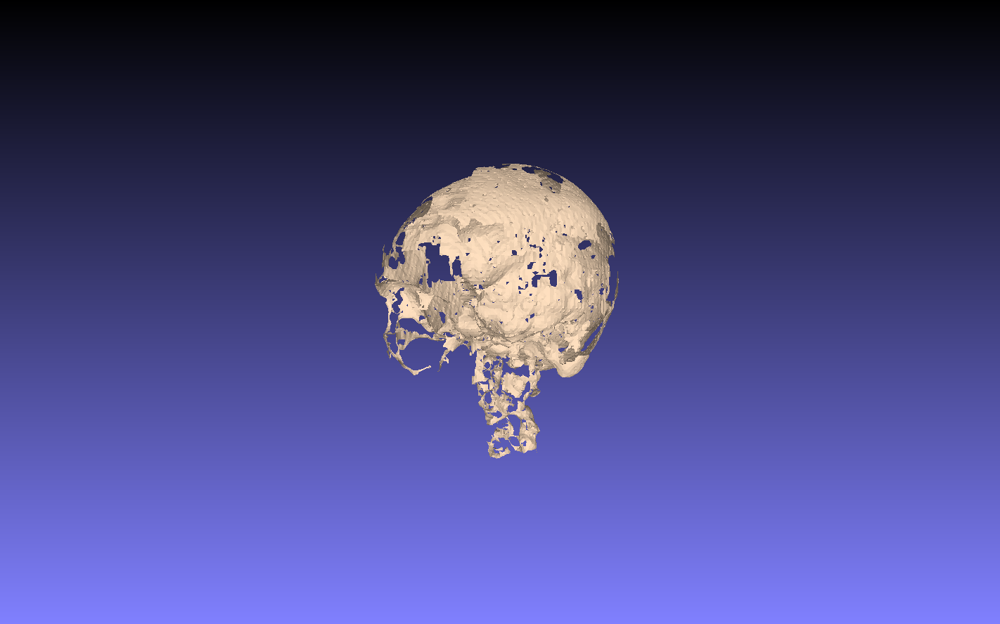
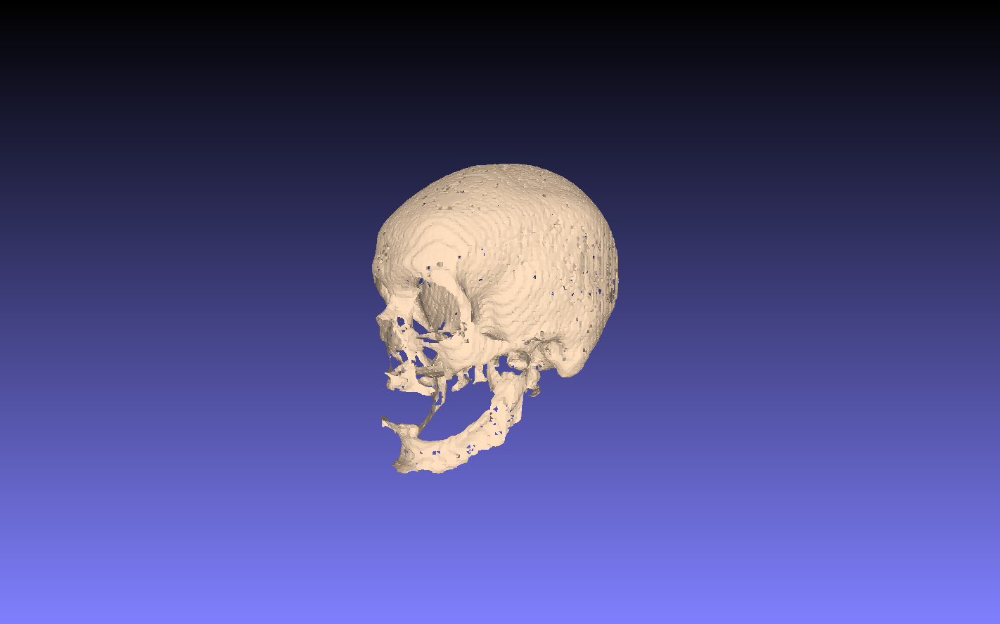
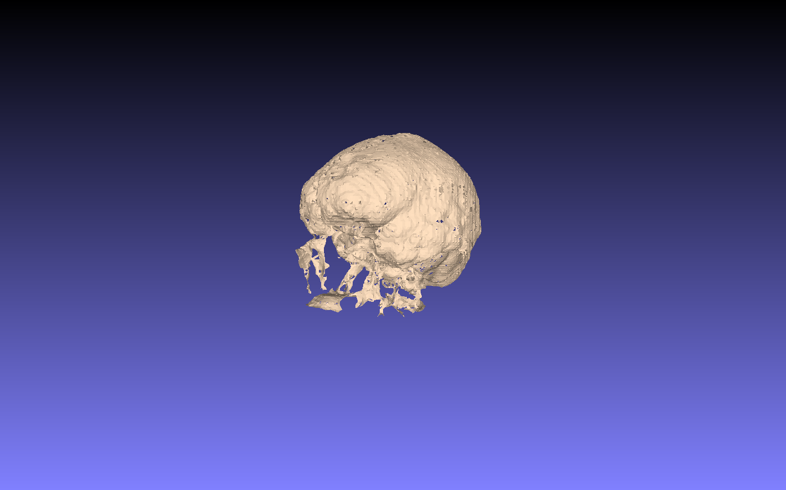
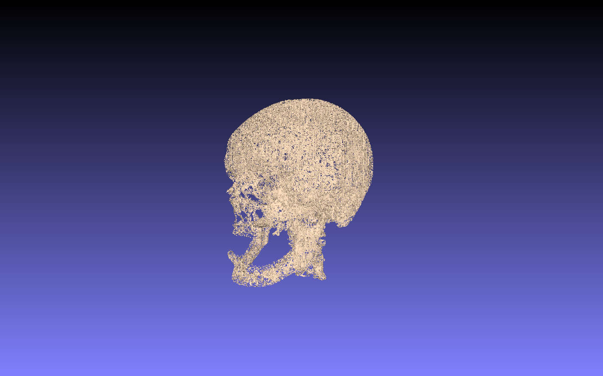

# open3d_playgound
This project is a personal exploration of the Open3D library — a powerful open-source toolkit for 3D data processing.
It includes experiments with point clouds, mesh reconstruction, noise removal, 3D Transformation and surface visualization techniques.

# Open3D Playground — Step-by-Step Titles

🟢 Step 1 — Getting Started with Point Clouds  
🔵 Step 2 — Visualizing and Exploring 3D Data  
🟣 Step 3 — 3D Transformation Tricks (Rotate, Scale, Translate)   
🟠 Step 4 — Downsampling and Noise Removal  
🔴 Step 5 — Normal Estimation and Orientation  
🟢 Step 6 — From Point Cloud to Mesh (Surface Reconstruction)  
🔵 Step 7 — Mesh Simplification and Smoothing  
🟣 Step 8 — Mesh Coloring  
🟠 Step 9 — Exporting & Saving 3D Data (PLY, OBJ, GLB, …)  

# 🩻 Dataset Source - point cloud

Special thanks to Terrie Simmons-Ehrhardt for making this resource publicly available — which was derived from a CT scan and converted into a 3D point cloud.
https://youtu.be/00JkLcklOpc?si=onoUuJXZJf0S-J-G

# Requirements
- Open3d
- Numpy
- Matplotlib

Optional tools for editing or visualization:
  - Blender
  - MeshLab

## 🧱 Discussion & Results
Preprocessing has a significant impact on the final reconstruction quality.
The choice of filters, radii, normal estimation parameters, and algorithm type (Poisson vs. BPA) can drastically change the mesh structure and level of detail.
There is no one-size-fits-all configuration — each dataset may require specific tuning based on point density, noise, and scale.  

In below, you can see a comparison of different reconstruction results to visualize how preprocessing choices affect the final surface.

### Poisson Surface Reconstruction

- **Downsample:** 1 voxel  
- **Normal Estimation:** Hybrid parameters (Orientation per 50 tangent plane) 
- **Poisson-Depth:** variable

  <figure style="display:inline-block; margin-right:10px;margin-bottom:10px;">
    
    <figcaption">Normal Estimation: Hybrid, rad=2*avg_distance, Depth=9</figcaption>
  </figure>
  <figure style="display:inline-block; margin-right:10px;margin-bottom:10px;">
  
    <figcaption>Normal Estimation: Hybrid, rad=3*avg_distance, Depth=9</figcaption>
  </figure>
  <figure style="display:inline-block; margin-right:10px;margin-bottom:10px;">
  
    <figcaption>Normal Estimation: Hybrid, rad=3*avg_distance, Depth=15</figcaption>
  </figure>
  

- **Downsample:** variable
- **Normal Estimation:** KNN=30 (Orientation per 50 tangent plane) 
- **Poisson-Depth:** 15

  <figure style="display:inline-block; margin-right:10px;margin-bottom:10px;">
  
    <figcaption>Downsample: 1 voxel</figcaption>
  </figure>
  <figure style="display:inline-block; margin-right:10px;margin-bottom:10px;">
  
    <figcaption>Downsample: 0.5 voxel</figcaption>
  </figure>

### BPA Surface Reconstruction

- **Downsample:** 1 voxel  
- **Normal Estimation:** Hybrid parameters  
- **Note:** Orientation per tangent plane varies

  <figure style="display:inline-block; margin-right:10px;margin-bottom:10px;">
    
    <figcaption">Orientation per tangent plane: 5</figcaption>
  </figure>
  <figure style="display:inline-block; margin-right:10px;margin-bottom:10px;">
  
    <figcaption>Orientation per tangent plane: 15</figcaption>
  </figure>
  <figure style="display:inline-block; margin-right:10px;margin-bottom:10px;">
  
    <figcaption>Orientation per tangent plane: 20</figcaption>
  </figure>
  <figure style="display:inline-block; margin-right:10px;margin-bottom:10px;">
  
    <figcaption>Orientation per tangent plane: 50</figcaption>
  </figure>

- **Downsample:** 0.5 voxel  
- **Normal Estimation:** Hybrid parameters and KNN

  <figure style="display:inline-block; margin-right:10px;margin-bottom:10px;">
  
    <figcaption>Normal Estimation: Hybrid - 20 tangent plane</figcaption>
  </figure>
  <figure style="display:inline-block; margin-right:10px;margin-bottom:10px;">
  
    <figcaption>Normal Estimation: KNN=30 - 50 tangent plane</figcaption>
  </figure>

